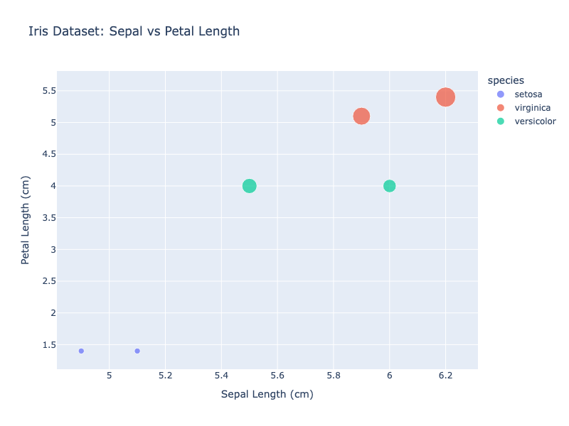

# Projects

A selection of projects and research threads that reflect my current technical profile.

## Healthcare Analytics: Patient Outcome Modelling (MIMIC-III)

Large-scale clinical data processing and modelling project built on ICU patient data.

- Queried, cleaned, and processed 40,000+ patient records using SQL and Python.
- Worked with missing values and irregular time-series structure.
- Built a pathogen alert classification system for clinical safety use cases.

## Predicting PMSM Rotor Temperature and Torque

Machine learning project on permanent-magnet synchronous motor performance.

- Developed CNN and Random Forest models in Python.
- Engineered time-series features for thermal and torque prediction.
- Benchmarked model quality with MAE and RMSE.

## CO2 Emissions and Fuel Use in Europe

Time-series and regression analysis of European emissions and fuel consumption data.

- Modelled data covering 1990 to 2020.
- Applied regression and ARIMA forecasting.
- Improved out-of-sample accuracy over a linear baseline.

## AI Healthcare Validation Analysis

Worked on evaluation workflows for an AI-powered semen analyzer in a healthcare startup environment.

- Compared device outputs against reference measurements.
- Used sensitivity, specificity, and Bland-Altman analysis for agreement assessment.
- Supported FDA regulatory submissions and peer-reviewed publication work.

## International Retail Coffee Price Dynamics

Early quantitative modeling project presented to an external examiner panel.

- Modelled international retail coffee price margins as a stochastic random walk in MATLAB.
- Focused on pricing dynamics and quantitative interpretation.

## Data Explorer - Iris Dataset

An interactive web application built with Shiny for exploring and visualizing the Iris dataset.

This project demonstrates object-oriented Python design patterns applied to a user-facing data visualization application. It uses Shiny for interactivity and Plotly for dynamic visualizations.

[View Project Details →](project1.qmd)
